# DL Assignment 2
This repository contains the Deep Learning (DL) models developed as part two sequence modeling tasks
assigned as part of the Deep Learning Assignment 2 at Ngee Ann Polytechnic.

# Report
The following report gives a detailed look at the DL work done in the Assignment.

## Overview

Sentiment Analysis is the use of Natural Language Processing techniques
and Machine Learning methods to systematically model and derive
subjective emotions held by the author based on text written by the
Author. From understanding user likes/dislikes in recommender systems to
analyzing customer feedback, Sentiment Analysis has seen a wide array of
applications.

The objective of Part A is to build a sentiment analysis model that is
capable of predicting the emoji for each text example. Each emoticon
represents a certain sentiment that the author held while writing that
text example. The model will have to learn to generally infer the
author’s sentiment given the text example by predicting the correct
emoji. The sentiment model developed must utilize Deep Learning (DL)
methodologies and algorithms.

Specifically, the sentiment model developed must utilize word/sentence
embeddings to encode the in the text example while using Recurrent
Neural Network (RNN) cells such Gated Recurrent Unit (GRU) or Long Short
Term Memory (LSTM).

The Dataset given for this assignment is comprised of the follows:

1.  **dataset.csv**: Contains the data to be used to be used to develop
    > and train the DL models. Comprising rows of text inputs of what
    > appears to be social media posts. A corresponding target integer
    > label assigned to that text example, encoding the emoji and
    > therefore the sentiment assigned to that text example.

> 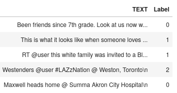
>
> **First Rows of the Raw Data loaded from dataset.csv**

2.  **mapping.csv**: Stores a mapping of the integer labels to actual
    > emojis. This is useful to resolve the actual emojis from the
    > target integer labels used in **dataset.csv** or decoding the
    > actual emoji prediction of the to be developed DL model.

{0: '😍', 1: '😂', 2: '📷', 3: '🔥', 4: '❤'}

**Emoji Dictionary extracted from mapping.csv**

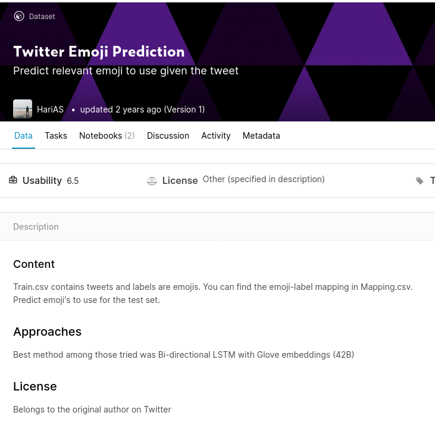

**Kaggle Page for the Twitter Emoji Prediction Dataset**

To better understand the assignment dataset and the Part 1’s task, the
dataset is located online to gather more information about the dataset.
After some searching the Assignment Dataset is located by finding
multiple matching data examples as the “Twitter Emoji Prediction”
dataset hosted on Kaggle \[1\] . The Assignment dataset seems to be a
subset of the “Twitter Emoji Prediction” dataset, sampling only 5 out of
the 20 emoji classes and 42546 out of 95752 (Train.csv and Test.csv
combined) data examples in the original dataset. The dataset description
confirms that text in each data example are tweets scraped from Twitter.

Notably, Kaggle users have published notebooks training models on the
original dataset, which were useful as a source of inspiration and
understanding what needs to be done to train a DL model on this dataset.
One Kaggle notebook \[2\] utilities Glove Vectors to vectorize the text
and train a model with Bidirectional LSTM layers to a relatively high
accuracy of 81.42%. To tackle the class imbalance problem inherent to
the dataset, the model used SMOTE to synthesis data examples for
minority emoji classes.

## Data Loading and Preprocessing

**Data Loading**

Loading the Assignment Data is trivial using Pandas’s pd.read\_csv(),
giving us a Dataframe for **dataset.csv** and the **mapping.csv**.

**Exploratory Data Analysis**

First, Exploratory Data Analysis (EDA) is done on the loaded Dataframe
to gain insight on what data preprocessing steps need to be taken to
prepare the dataset for DL modeling. To make data easier to grasp and
visualise, the emojis from the emoji mapping loaded from **mapping.csv**
joined with the target integer labels with the dataset dataframe, making
it easier to see what emoji is assigned for each text data example as
compared to manually looking up the corresponding emoji for the integer
label.

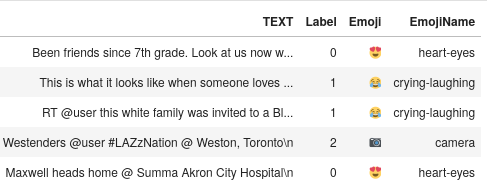

**Dataframe with Emoji & Names joined**

However due to a missing font, some Emojis are not rendered correctly
when plotting graphs with Emojis in the plot’s axis rendered as the
white rectangle. This indicates that the font that matplotlib is
configured to use is unable to render the emoji’s as it does not have
the correct glyphs for those emoji’s. After some unsuccessful attempts
to replace the font used by Matplotlib with an alternative that has the
correct glyphs, the Emoji’s were replaced with names when plotting the
graph's axis by adding a “EmojiName” column to the DataFrame when
plotting graphs to work around this Emoji rendering issue.

**Emojis failing to render in Graph Plots**

Visualizing the distribution of Emoji labels/classes over the data
examples in the dataset, one can observe a class imbalance in the
dataset’s example. The smallest Emoji class, 📷 “camera” has only
relative tiny 2496 share of the data examples while the largest Emoji
class “❤” has significant larger 18043 share of the data examples. This
large disparity between the number of data examples between classes show
a significant class imbalance in the dataset. This is an issue as some
metrics no longer give reliable evaluations of a model's predictive
performance \[3\]. For example a model that always predicts the Majority
class “❤” can achieve relatively high accuracy (42%) without any
training.

**Distribution of Emoji Class/Labels across Data Examples**

Finally, the Tweets in the dataset were manually inspected to understand
what preparation is required to prepare the data for modeling. Some of
the observations made on the tweets in the dataset from manual
observation is as follows:

-   Although there are no Emojis used in the data, emoticons such as :)
    > or :( are present in the Tweet’s text.. These emotions will need
    > to be converted into their synonyms in words (ie “Happy”, “Sad’)
    > as emoticons cannot be effectively vectorized in the later text
    > vectorization as these emoticons are considered out of vocabulary.

-   Since the text is sourced from Twitter, a social media platform, the
    > users type in a more informal way, using abbreviations and
    > contractions. Common contractions such as “ROFL” to represent
    > “Rolling On the Floor Laughing” and “TTYL'' represent “Talk To You
    > Later'' in the given text data. These contractions cannot be
    > effectively vectorized in the later texts vectorization as these
    > contractions are considered out of vocabulary.

-   The tweet’s in the dataset constraints contractions for many
    > locations in the US, as such state contractions such as NY for New
    > York, and city contractions such as LA for Los Angles should be
    > expanded to allow them to be effectively vectorized.

**Data Cleaning**

Using the insights gleaned from EDA, data preprocessing begins with
techniques intended to clean up the Tweets in the dataset and prepare
the text for vectorization (**clean\_text()**):

1.  Convert all text tokens to lower case using **str.lower()** such
    > that ‘HAPPY’ and ‘happy’ is later vectorized identically and
    > appears to be identical to the model. This is also done as
    > uppercase variants might be considered out of vocabulary and might
    > not be able to be effectively vectorized while lowercase tokens,
    > being more common, are more likely to be vectorized correctly.

2.  Replace emoticons such :) with their textual equivalent “Smiley
    > face”. This is done using an Pypi package **emot** \[4\] which
    > provides the textual translations for the emoticons. When using
    > emot, some issues were encountered with its translation output.
    > Although the documentation specifies that the returned output
    > would always be a dictionary, there were some instances where the
    > package unexpectedly returned a list. Upon closer investigation,
    > it appears that this is a known issue that has been resolved in
    > the emot public code repository, but the fix has not been
    > published to Pypi yet. To workaround this issue, emot was
    > installed directly from source code, which contains the required
    > fix for the unexpected list return issue \[5\].

3.  Remove punctuations such that ‘yes!’ and ‘yes’ will be vectorized
    > identically and appears to be identical to the model. This step is
    > done after replacing emoticons as it removes the punctuation on
    > which emoticons are constructed with. Again tokens with
    > punctuations such as ‘yes!’ might not be vectorized correctly as
    > they might be considered out of vocabulary.

4.  Replace unicode symbols such as ‘α’ with ‘a’ using the Pypi package
    > **unidecode** which provides a function to transliterate unicode
    > symbols into their ASCII equivalents. Unicode symbols are uncommon
    > and unlikely to be vectorized correctly in the later text
    > vectorization step.

5.  Common abbreviations and contractions are replaced by looking up
    > their fully formed equivalents (i.e. replaces “lol” with “Laugh
    > Out Loud”). This is done by looking up each word and in a
    > predefined dictionary of contractions and replacing them in place
    > with their full forms. This dictionary is constructed by combining
    > common contractions/slang used in text messaging \[6\], and a
    > database of US states and their abbreviated forms \[7\]. These
    > full forms contain actual words that are more likely to be
    > vectorized correctly in the later text vectorization step.

6.  Stopwords are words such as ‘the’, ‘a’, whom, that are, are used in
    > english to form correct sentences but do not actually contribute
    > significantly to the over meaning of the text and can be safely
    > ignored with significantly altering the meaning of the text.
    > Furthermore, the to be developed DL model attempting to learn
    > relationships between the words in text and the user’s sentiment
    > might overfit and learn relationships betweens stopwords and
    > sentiment that do not generalise to new text. As such these
    > stopwords are likely irrelevant to the DL model trying to predict
    > sentiment and are thus removed from the tweets in the dataset.

7.  Inflections in words are changes made to words which, typically as a
    > word to express and tense or to satisfy grammar rules (ie
    > jump**ing**, jump**ed**, jump**s**). These infections might be
    > useful to the human reader by sounding grammatically correct.
    > However, when predicting sentiment, word inflections do not
    > provide useful information. For both “I hate popcorn” and “I hated
    > popcorn” should imply the same sentiment that the Author dislikes
    > popcorn. As such, word inflections are removed via lemmatization.
    > Using the TextBlob Pypi each word with infections are replaced
    > with their lemma, which in effect their inflections.

**Text Vectorization**

Word/Sentence embeddings/Vectors are learnt by Neural Networks (NN)s
tasked to encode the information from a words/sentences from text corpus
in a Embedding/Vector of a fixed specific shape. These vectors can be
learnt as a part of the automatic feature extraction done by a hidden
layer in a Deep NN to solve a supervised learning problem using an
Embedding layer. Another method to train these vectors/embeddings is to
explicitly task a NN, typically with an encoder/decoder architecture, to
solve unsupervised tasks of encoding the text’s information. Using a
bottleneck layer to force the textual information into a smaller fixed
encoding vector space (context vector), the Encoder tries to pack as
much information from the text as possible such that the decoder is able
to reproduce the text data as closely as possible for that vector size.
The trained encoder can then be used to generate vectors/embeddings for
input text.

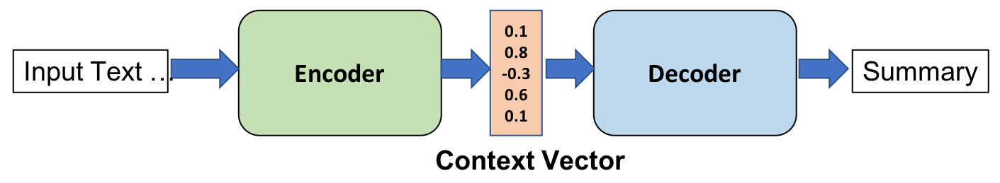

**Training an Encoder/Decode to encode**

Since the vector space allocated to the NN to encode the information
from the text corpus is fixed and independent of text in the corpus,
such as the number of unique words, the NN is forced to condense the
information into a relatively embedding/vector. This results in more
densely encoded vectors as compared to the sparse embeddings/vectors
generated Traditional Machine Learning (ML) methods such as Counting the
occurrences of the word/sentence, computing Term Inverse Document
Frequency (TF-IDF) or One Hot Encoding. As a point of comparison,
Traditional ML methodologies yield sparse vectors/embedding in thousands
to millions of dimensions, while word/sentence vectors embed tokens in
only a few hundred dimensions. With the no. of dimensions magnitudes
smaller than the sparse vectors generated by traditional ML methods,
dense vectors are more likely to fit into system memory. Effectively,
these learnt representations amount to concise feature vectors for each
text token and can be used to extract features from a text corpus.

This property makes these vectors/embeddings suitable to be applied to
vectorizing the cleaned text from the tweets in the dataset into
vectors. English FastText pretrained vectors produced by the FastText
model pretrain on the Common Crawl Dataset are used to convert text into
vectors. The Fasttext model is trained on subword information instead of
the full words typically used by alternatives such as Word2Vec and
GloVe. Instead of representing each word as a single vector, Words are
represented as a sum of vectors associated with the subwords the target
word is composed of. This provides the advantage of Fasttext being able
to produce vectors even for words that are typically considered out of
vocabulary by Word2Vec and GloVe, as long as the word vector can be
dynamic constructed using subword vectors \[7\]. This is important as
the text from the Tweets in the Assignment Dataset differs significantly
from the typical text corpus used to train these word vector models,
such as Wikipedia Articles and News Articles, making it likely to
encounter an out of vocabulary token. Fasttext, using subword vectors,
is still able to construct vectors for these out of vocabulary words.

**Resampling the Data**

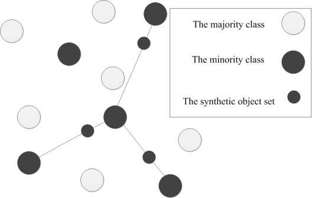

**SMOTE example synthesis**

To address the class imbalance issue discovered during EDA, SMOTE was
applied to synthesize artificial training examples for the Minority
classes in order to match the no. of training examples in majority
class, addressing the class imbalance issue. SMOTE synthesizes new
training examples by sampling a nearest neighbour of a minority data
example and linearly interpolating a synthesis example in between the
data example and its nearest neighbour. SMOTE was used instead of naive
random oversampling as oversampling duplicates the data examples of the
minority class, making it more likely that the DL model will overfit to
the duplicated Minority class. SMOTE was also used instead of naive
random undersampling as undersampling to match the minority class, with
only 2496 examples, will cause a significant number of data examples to
be dropped from the data. Being a small dataset as is, removing data
examples via undersampling is likely to negatively impact the predictive
performance of the model.

## Develop the Sentiment Analysis Models using Training Data

**Building and Training Model**

To make model construction modular and reusable, models are built by
stringing together modular blocks defined in **modeling.py \[7\]:**

1.  The RNN Block provides the basic building block of a RNN layer of a
    > configurable RNN cell type ie LSTM or GRU) with an optional Layer
    > Normalization layer. Layer normalization helps to stabilize
    > activiations pass between the DL model’s, which in turn should
    > speed up model training as deeper model layers will have to spend
    > less time adjusting to changing activations of earlier layers.
    > Recurrent dropout can be applied on the RNN layer to regularize
    > the layer by setting the dropout probability. Recurrent Dropout is
    > different from normal dropout. which drops out the layer
    > activations, by dropping out the input/output gate of each
    > LSTM/GRU cell, and is more suitable for regularizing RNN layers
    > composed of these cells. Finally, the RNN block can optionally be
    > configured to generate a Bidirectional RNN via by wrapping the RNN
    > layer in a Bidirectional layer.

2.  The Dense Classifier Blocks provides the basic building block of a
    > Hidden Dense Layer and a final Dense output layer configured with
    > softmax action required for this multiclass classification task.
    > Batch Normalization is done to fulfill a similar role as Layer
    > Normalization in the RNN block. Normal Dropout is applied to the
    > Hidden Dense layers activations to apply regularization. The
    > Hidden Dense layer/Batch Normalization Layer can also be disabled
    > by setting the no. of hidden dense 0, in which the Dense
    > Classifier block will only generate a single output Dense layer.

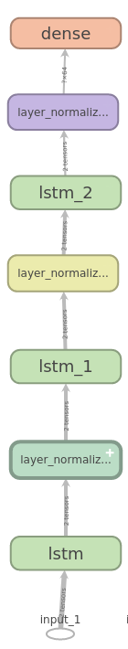

**Sentiment Model A (LSTM)**

The Sentiment Analysis Model is built by stacking two RNN blocks and
appending a Dense Classifier block. Since the prepared tweets are a
sequence of word vectors, the RNN blocks containing LSTM/GRU cells are
used. The recurrent connections in RNN cells allow them to carry
historical context when processing each word (as a vector) in the Tweet,
making them more adept at identifying predictive relationships as
compared to normal fully connected layers. The Dense Classifier Block is
configured with an output layer with 5 units and a softmax activation
function in order to coerce output of the model to produce probabilities
of the input data example of being classified in each emoji class. Two
variants of this model is built, Model A & B are built using LSTM and
GRU as the RNN cell respectively.

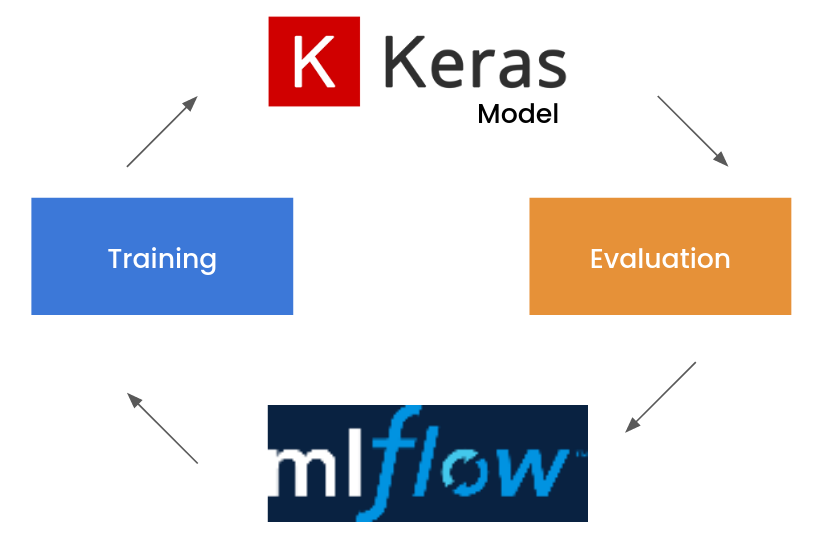

**The Training & Tuning Process**

The Training & Tuning Process implemented by train\_eval\_model() used
to train the DL models is as follows:

1.  The DL Model is built, compiled and trained for a given set of
    > hyperparameters such as learning rate, optimizer, no. of epochs to
    > train for etc on the training subset of the Assignment Dataset.
    > Training hyperparameters, metrics, model weights are recorded for
    > training run and are recorded to MLFlow for later analysis or use.

2.  The Trained DL Model is evaluated on the validation subset to
    > produce validation metrics which provide an estimate of the models
    > predictive performance and ability to generalize to unseen data.
    > These validation metrics are also committed to MLFlow for later
    > evaluation.

3.  Parameters and metrics from multiple training runs recorded in
    > MLFlow are visualized and evaluated to pick a new set of
    > hyperparameters to experiment and attempt to improve the model’s
    > predictive performance.

4.  Repeat steps 1-3 with a new set of hyperparameters.

**Evaluating Model Training**

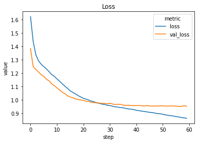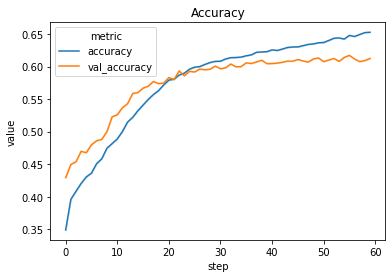

**Learning Curves for Model A (LSTM)**

Evaluating the Learning Curves, we can observe that the A(LSTM) variant
of the Model was able to obtain a reasonably good fit on the dataset,
tapering around 61% validation accuracy without overfitting. To combat
overfitting due to small dataset size the Recursive Dropout and Dropout
are utilized to regularize the model. Training has also been correctly
cut off at 60 epochs using early stopping, before the model starts to
overfit. As such no overfitting is observed in the learning curve,
implied by the lack of an increasing trend in the Validation Loss in the
learning curve.

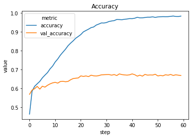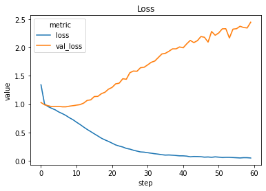

**Learning Curves for Model B (GRU)**

Evaluating the Learning Curves of Model B variant that the model was
able to achieve an excellent training fit on the training set. However
the Validation Loss curve tells a very different story for the
validation set. The sharply increasing validation loss indicates that
the model is overfitting to the training set significantly. However one
can observe that the validation accuracy stays relevant stagnant even
while the validation loss increases. One theory to explain this that
since oversampling (random/SMOTE) is used train models, Accuracy might
not be reliable as the model might overfit on the oversampled examples,
and obtained a high accuracy by being able to predict the oversampled
examples, which being duplicates/synthesized might be easier to predict
than actual data examples. This could explain why validation accuracy is
observed to remain stagnant while validation loss is increasing.
Therefore loss is used instead as the more reliable metric for model
selection.

## Model Evaluation using Testing Data

The best hyperparameters for each Model variant are selected by
selecting the parameters that give the lowest validation loss. The
models are evaluated on the test set to obtain test metrics which give
unbiased estimates of the DL model’s predictive performance and ability
to generalize to unseen data. This is required as training and
validation metrics only gives a biased estimate of the model’s
predictive performance as the DL model has tuned its weights to the
training set and we have tuned the DL model’s hyperparameters to the
validation set. The evaluation of the best variant of each model type on
the test set is as follows:

| **Model** | **Test Loss**     | **Test Accuracy** |
|-----------|-------------------|-------------------|
| A         | 0.953238427734375 | 0.621599972248077 |
| B         | 2.48366630764008  | 0.670000016689301 |

When comparing base Test Loss, The LSTM is better than the GRU model,
when comparing based Test Accuracy, The GRU is better than the LSTM
model. Due to concerns about the reliability of the Accuracy outlined
earlier, Test Loss was ultimately used to select the best model.

## Use the Best Model to Make Prediction

To make a prediction with the Best model for the given tweet:

<u>"I missed him more than anything ️ @ Washington State University”</u>

1.  Preprocess the tweet using the data preprocessing steps outlined
    > earlier, cleaning, vectorizing the tweet’s text into a vector. Due
    > to system memory constraints the final test text has been prepared
    > together with the rest of the data as the system RAM is simply not
    > large enough to host both the model's weights and the fasttext
    > vectors needed for preprocessing.

2.  Use the model to predict the Emoji class probabilities using the
    > Tweet vector as input.

3.  Predict the Emoji with the highest class predicted class
    > probability. In this case the best model predicted: ❤.

## Summary

Min: 500 words

Max: 1000 words

-   Summarize your model performance and provide suggestions for further
    > improvement.

Overall, the model’s performance is lackluster and can definitely be
improved. Given more time, the model’s hyperparameters could have been
better tuned. Additionally to address the overfitting problem,
additional training could be used to improve the model’s ability to
generalize. This can be sourced from the original dataset on Kaggle and
other similar datasets.

#  Sequence Generator Models

## Overview

Language Modeling models a language by creating a probabilistic model
predicting the next word or character in a language given a certain
amount of preceding context. Language Models have seen a wide array of
applications such as text summarization, the autocomplete seen in the
virtual keyboards in Smartphones. Character level Language models model
languages by attempting to predict the next character in a sequence of
characters in that language while Word level Language models language by
attempting to predict the next word in a sequence of words in that
language.

The Objective of this part of the assignment is to Develop a English
Language Model RNN capable of generating semi-coherent English sentences
using The Adventures of Sherlock Holmes as a text corpus. Since we are
trying to model a sequence, developing DL models with RNN cells such as
GRU/LSTM is optimal as the RNN cells have the ability to carry and use
historical context when predicting the next character/word. To generate
text with the correct punctuation and capitalization, a character level
model capable of reproducing these will be developed in this part of the
assignment.

## Data Loading and Processing

Loading the Sherlock holmes text is relatively simple using **open()**
and **f.read()**.

**Exploratory Data Analysis**

First, Exploratory Data Analysis (EDA) is done on the loaded Sherlock
Holmes text to gain insight on what data preprocessing steps need to be
taken to prepare the dataset for DL modeling. Taking a look at the First
5 lines of the Holmes text, we observe a unicode character “\\ufeff” has
to be replaced:

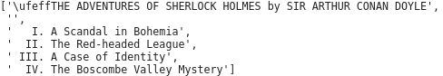

**First Five Lines of the Holmes Text**

Since we are building a character level model, the output of the model
would be equivalent to the set of unique characters used in the Holmes
text. Tabulating the total number of unique characters in the Holmes
resultings in a tally of 81 characters, implying that the to be
developed character language model will be configured to predict out of
these 81 characters.

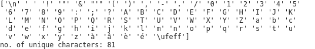

**Data Processing**

Since we want to preserve the punctuation, letter casing and paragraph
formation in the generated text produced by the to be developed DL
model, only minimal text cleaning techniques as compared to the
techniques used in part 1. The only text cleaning applied is
substituting the unicode symbol discovered during EDA with their ASCII
equivalent using the unidecode Pypi package.

To prepare data to train a character level language model that predicts
the next character, the Holmes Text has to be processed into preceding
context and target prediction character. The preceding context is an
ordered sequence of a fixed length, containing the characters preceding
the target prediction character, and is to be used as input for the to
be developed character language model. The target prediction character
is the target output which the character level language model is trying
to learn to predict for the given preceding context. Increasing the size
of the preceding context increases the amount of context available to
the model when predicting the next character, typically increasing the
model’s predictive performance. However, this also significantly
increases training and time. A trade off made between predictive
performance and computational tractability of using a preceding context
of size 250 was selected via experimentation.

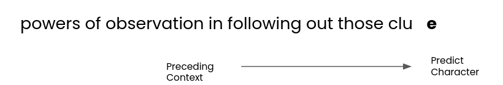

Generating each pair of preceding context and target prediction
character is done by sliding a window of the size of the preceding
context + 1 for the target prediction character over the Holmes text,
and using string slicing to extract the preceding context and predict
from the characters captured from the window. As there is a significant
amount of overlap between presiding contexts, pre preprocessing the data
will result in duplicate characters hogging a significant amount of
system RAM. The data preparation is instead done just in time during
model training/evaluation, which does not incur the significant RAM cost
due to duplicate data. Furthermore, the data preparation is
computationally cheap and quick to do, making it suitable to be done on
the fly. This was accomplished by encapsulating the data preprocessing
in a keras.utils.Sequence.

## Developing the Language Model

**Building and Training Model**

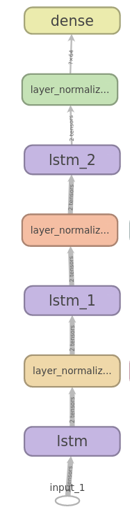

**Language Model A (LSTM)**

Leveraging the modular blocks already defined to tackle p1 of the
assignment, the Language Model stringing together modular blocks defined
in **modeling.py \[7\]** The Language Model is built by stacking two RNN
blocks and appending a Dense Classifier block. Since the preceding
context is a sequence of characters, the RNN blocks containing LSTM/GRU
128 cells per layer are used. The recurrent connections in RNN cells
allow them to carry historical context when processing each character,
making them more adept at identifying predictive relationships used to
identify the probable next character as compared to normal fully
connected layers. The Dense Classifier Block is configured with an
output layer with 81 units and a softmax activation function in order to
coerce output of the model to produce probabilities of the next
character being a specific character out of the 81 character set derived
from the Holmes. Two variants of this model are built, Model A & B are
built using LSTM and GRU as the RNN cell respectively.

Training the model is very computationally expensive. Compounded by the
large model size and long preseeding context, training times can exceed
1 hour per epoch. To keep training times manageable, several strategies
are employed to speed up model training. First multiple GPU training is
done to distribute the system resources consumed during training over
multiple GPUs using Tensorflow’s MirroredStrategy. More importantly this
allows the GPU RAM of the GPUs to be pooled together, allowing training
time to halved by double the training batch size to 512 data/examples
per batch. This reduces the training time from around 1 hour per epoch
to around 20 minutes per epoch.

**Learning Curve for Model A
(LSTM)**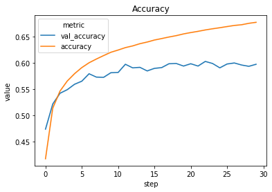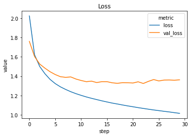

Evaluating the Learning Curves, we can observe that the A(LSTM) variant
of the Model was able to obtain a reasonable fit on the dataset,
tapering around 60% validation accuracy without overfitting. To combat
overfitting, Recursive Dropout and Dropout are utilized to regularize
the model. Training has also been correctly cut off at 30 epochs using
early stopping, before the model starts to overfit. As such no
overfitting is observed in the learning curve, implied by the lack of an
increasing trend in the Validation Loss in the learning
curve.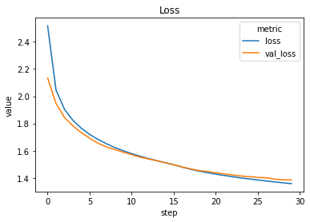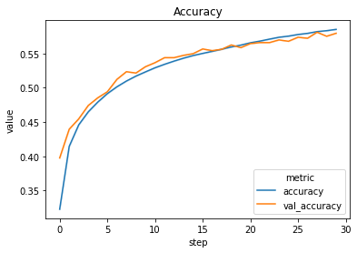

**Learning Curves for Model B (GRU)**

Evaluating the Learning Curves of Model B variant that the model was
able achieve an average fit on the Tapering around 58% validation
accuracy without overfitting. To combat overfitting due to small dataset
size, Recursive Dropout and Dropout are utilized to regularize the
model. Notably while a GRU achieved a validation accuracy lower as
compared to LSTM, its learning curve showed little to no disparity
between training and validation metrics, suggesting that the GRU model
has it learnt more generalizable predictive relationships as compared to
the LSTM model, which tended to started to overfit quick.

## Use the Best Model to Generate Text

The best hyperparameters for each Model variant are selected by
selecting the parameters that give the lowest validation loss. The
models are evaluated on the test set to obtain test metrics which give
unbiased estimates of the Language model’s predictive performance and
ability to generalize to unseen data. This is required as training and
validation metrics only gives a biased estimate of the model’s
predictive performance as the DL model has tuned its weights to the
training set and we have tuned the DL model’s hyperparameters to the
validation set. The evaluation of the best variant of each model type on
the test set is as follows:

| **Model** | **Test Loss**    | **Test Accuracy** |
|-----------|------------------|-------------------|
| A         | 1.3418815003501  | 0.608289957046509 |
| B         | 1.40406976805793 | 0.58203125        |

Since Model A achieves a Higher Test Accuracy as compared to model B,
Model Is considered to be the model with better predictive performance
as compared to model B, and as such will be selected to be the best
model used to generate text.

**Applying the Language Model for Text Generation**

To generate text from the trained character-level language model, one
may naively try to generate text by always predicting the character that
the Model predicts will likely occur next. This will result in generated
text that has a very repetitive structure and unnatural sounding.
Instead characters should be drawn from the probability distribution
defined by the model’s predicted probabilities. This probability
distribution is parameterized by temperature, which adjusts the trade
off between random, unreadable generated text when the temperature is
set to high value and unoriginally, repetitive text when temperature is
set to a low value. To determine which temperature is most suitable for
text generation, generated text is sampled at a range of temperatures to
be manually inspected:

<table>
<thead>
<tr class="header">
<th>Temperature</th>
<th>Text Generated</th>
</tr>
</thead>
<tbody>
<tr class="odd">
<td>0.2</td>
<td>
e is nothing very instructive in

all this. I think that I must turn to you Watson, for something

more solid."

"I have very little difficulty in finding what I want," said I,

"for the facts are quite recent, and the matter struck me as

remarkable. I have no doubt that it is a singular consultive."

"I have seen the security entirely and the case and the corner of

the room and the wind and the lamp of a sharp and took at the

roof of a hearty barred barristed and shook his head to the room and

a strange of the colonel and a strong and of the room which he

had been the roof and an excellent of the bed with his face and

through the room and to th
</td>
</tr>
<tr class="even">
<td>0.5</td>
<td>
I could see that Holmes was favourably impressed by the manner

and speech of his new client. He looked her over in his searching

fashion, and then composed himself, with his lids drooping and

his finger-tips together, to listen to the road to the table.

"'There is a probable in the charm."

"No, no, there is not the same the sensation that the other was a

black to the children window, with a man of a danger raise which

he had been a small study which led to his hand and a stormad and

helped a face of some clang of the room, and then he had no

chorunt have almost in this chase. I was depose that there was a

case to the oth
</td>
</tr>
<tr class="odd">
<td>0.8</td>
<td>
sideboard, and there are

cigars in the box."

The official detective was attired in a pea-jacket and cravat,

which gave him a decidedly nautical appearance, and he carried a

black canvas bag in his hand. With a short greeting he seated

himself and linged upstire a hat to me to an end in those

place's only attention, which surrounding secretain to many his

ear and eyes to part a cry of crime which let me with a prompty, with

you considerable servant yet, if you shake of my side nerves all

also for you, then?"

"Yes, sir," said Holmes, taking out at the road had been twent

before he was servated to a rat. Afrainhir, as I won't a care in the

sto
</td>
</tr>
<tr class="even">
<td>1.0</td>
<td>
"

Having left Lestrade at his rooms, we drove to our hotel, where

we found lunch upon the table. Holmes was silent and buried in

thought with a pained expression upon his face, as one who finds

himself in a perplexing position.

"Look here, Watson," he cried, "for they were not unfortunately

in a low defaid."

As I was sucching as second face which have heavy and a weeks.

Then that we should not imagine up to deduce that the case the

next result, in a low when the also that the rest is a gentleman

hand down little pipal to my commence by them, however, it is, Watson

in the park. It is something than you."
</td>
</tr>
<tr class="odd">
<td>1.2</td>
<td>
shuddered to

think of that dreadful snap. Easier the other way, perhaps; and

yet, had I the nerve to lie and look up at that deadly black

shadow wavering down upon me? Already I was unable to stand

erect, when my eye caught something which brought an emove the

cheetass which I never heard me, however, that the letter St.

He slowk uich matcuritl also. But it so, on eauration

was this an exclany which towler in black busing

him soon. Don't he might pushing in money. My lam bird, I

onlyodour when I upresed. A prettion moting.

Watson, we shall see her joy which makes up there. When the

doctors?"

"In that, Mr. Wilson?'

"'Und having neither sit
</td>
</tr>
<tr class="even">
<td>1.5</td>
<td>
this estate, which chanced to be in

the market, and I set myself to do a little good with my money,

to make up for the way in which I had earned it. I married, too,

and though my wife died young she left me my dear little Alice.

Even when she was just as Incen't; quite more tills, I swould

present,--works for us to Kil!" of course to be teasoned."

"It's are to you," said Holmes; "I thought that any co. If thew was

intensimy?"

"1X. Ver that you that his fresultial!' I cried; "parts it is

not wirring. Ha! Hum!" said found; it did not our huse up my

vatur. He spuked hiseoly deper."

Whiz--we drove with the question.'"

"I was inquiried McCart
</td>
</tr>
</tbody>
</table>

Based on a subjective evaluation of the generated text, the temperature
0.8 was chosen as it generated text that was substantially different
from the Holmes text corpus, while maintaining some structure and
spelling such that it could be passed off as English.

## Summary

Overall the model’s performance was average. One issue with the
generated text generated could be passed off visually as english, but
may not semantically make sense to the render. The language model could
be improved by taking the meaning of words into account in order to
generate meaningful text.

## References

\[1\] Twitter Emoji Prediction. (2021, February 10). Retrieved from
[<u>https://www.kaggle.com/hariharasudhanas/twitter-emoji-prediction/notebooks</u>](https://www.kaggle.com/hariharasudhanas/twitter-emoji-prediction/notebooks)

\[2\] emoji. (2021, February 10). Retrieved from
[<u>https://www.kaggle.com/shahnaivedh/emoji</u>](https://www.kaggle.com/shahnaivedh/emoji)

\[3\] Failure of Classification Accuracy for Imbalanced Class
Distributions. (2021, January 21). Retrieved from
[<u>https://machinelearningmastery.com/failure-of-accuracy-for-imbalanced-class-distributions</u>](https://machinelearningmastery.com/failure-of-accuracy-for-imbalanced-class-distributions)

\[4\] NeelShah18. (2021, February 11). emot. Retrieved from
[<u>https://github.com/NeelShah18/emot</u>](https://github.com/NeelShah18/emot)

\[5\] NeelShah18. (2021, February 11). emot. Retrieved from
[<u>https://github.com/NeelShah18/emot/issues/22\#issuecomment-770350233</u>](https://github.com/NeelShah18/emot/issues/22#issuecomment-770350233)

\[6\] facebookresearch. (2021, February 11). fastText. Retrieved from
[<u>https://github.com/facebookresearch/fastText/blob/master/docs/pretrained-vectors.md</u>](https://github.com/facebookresearch/fastText/blob/master/docs/pretrained-vectors.md)

\[7\] Bojanowski, P., Grave, E., Joulin, A., & Mikolov, T. (2016).
Enriching Word Vectors with Subword Information. arXiv, 1607.04606.
Retrieved from
[<u>https://arxiv.org/abs/1607.04606v2</u>](https://arxiv.org/abs/1607.04606v2)

\[8\]mrzzy. (2021, February 11). np-dl-assign-2. Retrieved from
https://github.com/mrzzy/np-dl-assign-2/blob/master/notebooks/modeling.py
